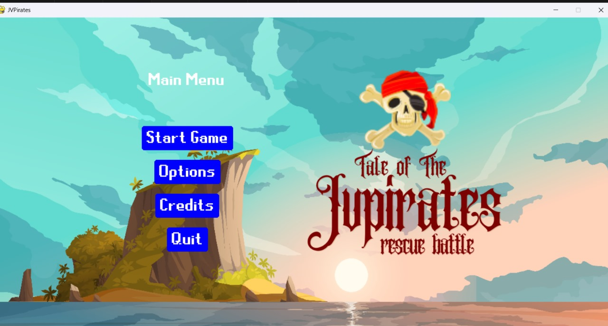

# The Tales of JV Pirates

A pirate-themed 2D adventure game built with **Python** and **Pygame** during **CraftQuest** at the **American Center Colombo** (AJAX program).



## About

Our team **Typhoons** created this as our first dive into 2D game development — level design, sprites, collisions, game loops, and teamwork under a deadline.

| | |
|---|---|
| **Program** | CraftQuest 2D Game Development — American Center Colombo |
| **Mentor** | Liyanage Kalana Perera |
| **Coordinator** | Janitha Alendra Arachchige |
| **Team org** | [TyphoonsLK](https://github.com/TyphoonsLK) |
| **Original repo** | [TyphoonsLK/JVPirates](https://github.com/TyphoonsLK/JVPirates) |

## Team Typhoons

Mohamed Jaufer Mohamed Hisshan, Shenali Madurapperuma, Sahan Jayamal, Thiyagarajah Madusheshan, Pasan Wanigasuriya

## Run locally (Windows)

**Requirements:** [Python 3.12](https://www.python.org/downloads/) (recommended). Python 3.14 may fail to install or run Pygame; use 3.12 if you hit errors.

1. **Clone the repo**

```powershell
git clone https://github.com/hisshanzzz/JVPirates.git
cd JVPirates
```

2. **Install dependencies**

```powershell
py -3.12 -m pip install -r requirements.txt
```

3. **Run the game** from the **project root** (not inside `code/`)

```powershell
py -3.12 code/main.py
```

## Controls

| Key | Action |
|---|---|
| Arrow keys | Move |
| Space | Attack |
| P | Pause |

## What we learned

- Pygame fundamentals (sprites, groups, game loop)
- Level design with Tiled maps (`.tmx` files)
- Team collaboration — communication, time management, debugging together

## Note

This copy on [hisshanzzz/JVPirates](https://github.com/hisshanzzz/JVPirates) is forked from the team organization repo for portfolio purposes. Full credit to Team Typhoons and American Center Colombo.
